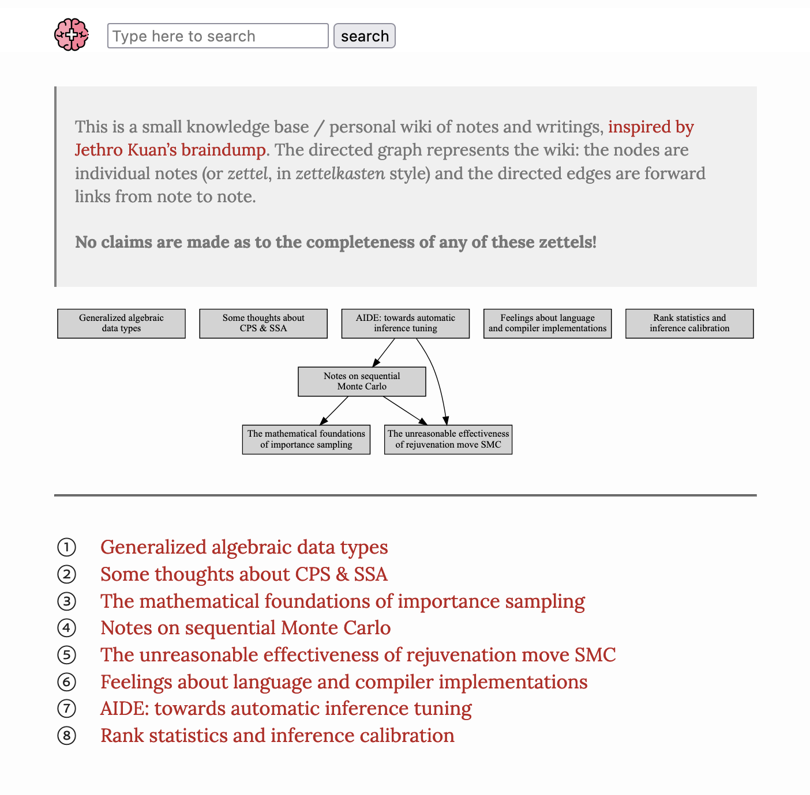

<div align="center">
<h1><code>notebook</code></h1>
<figure style="display:block;height:300px;width:300px">
</img>
<figcaption>
<a href="https://femtomc.github.io/notebook/">(Demo) my personal notebook</a>
</figcaption>
</figure>
</div>
<br>

> A `pollen`-like site template which supports the development of small knowledge bases and personal wikis. Sports extreme customization courtesy of `pollen`.

<br>

This was inspired by [org-roam](https://github.com/org-roam/org-roam) and [Jethro Kuan's braindump](https://github.com/jethrokuan/braindump) quite a bit -- but I found that I enjoyed using `pollen` and Racket for customizeability compared to Emacs Lisp. In particular, this does not restrict the notebook file format to `org`-like Markdown - but allows all the benefits [of using pollen](https://docs.racket-lang.org/pollen/second-tutorial.html#%28part._the-case-against-markdown%29).

I've tried to keep the JavaScript dependencies to a minimum:

1. [lunr](https://lunrjs.com/) to support a small search functionality
2. [mathjax](https://www.mathjax.org/) to support beautiful mathematics rendering
3. [highlight](https://highlightjs.org/) to support beautiful code rendering.

**To understand this repo, the most useful thing to understand is [pollen](https://docs.racket-lang.org/pollen/)**

---

#### Dependencies

```
pollen
graphviz
(optional) a working LaTeX distribution 
    if you wish to embed LaTeX *.svg
```

#### Building

Assuming you have the property dependencies setup and available in shell environment:

```
git clone https://github.com/femtomc/notebook
cd notebook/pollen
raco pollen start
```

This will start the notebook server on `localhost`.

When you're ready to deploy, the toplevel `build.sh` will command `pollen` to render everything, and put the result into the `docs` directory. 

Make sure you change the `.git` configuration to point to your notebook fork!
